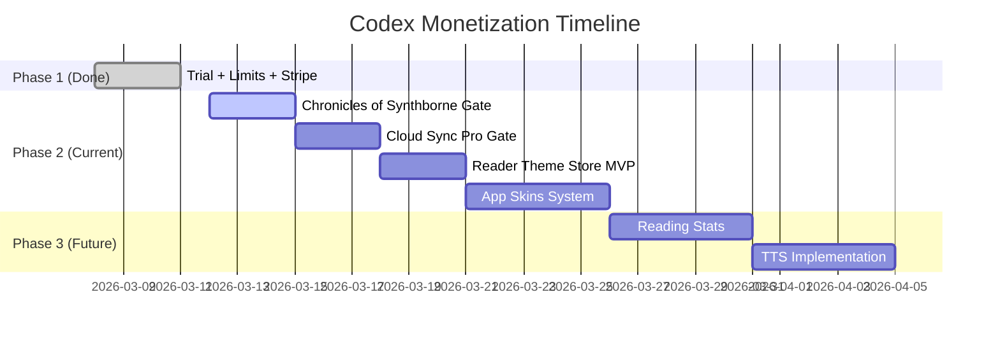

# Codex — Monetization Roadmap

> Living document outlining revenue streams, feature gating, and implementation priorities.

---

## Phase 1 — Trial & Limits ✅ Done

The foundation is live. Every new user gets a taste of Pro, then hits strategic friction points that drive conversion.

| Feature | Status | How it Works |
| :--- | :---: | :--- |
| 7-Day Pro Trial | ✅ | Auto-granted on signup. Full Pro experience from day one. |
| 3-Book Library Limit | ✅ | Free users can store up to 3 books. The 4th triggers [UpgradePrompt](file:///d:/dev/BookProject/src/components/subscription/UpgradePrompt.tsx#11-57). |
| Stripe Checkout | ✅ | [CheckoutButton](file:///d:/dev/BookProject/src/components/subscription/CheckoutButton.tsx#11-74) → Vercel Serverless → Stripe Checkout Session. |
| PRO Badge | ✅ | Gold badge next to "Codex" title for active Pro subscribers. |
| Trial Banner | ✅ | Shows remaining days ("5 days left") or expired state with inline upgrade CTA. |

---

## Phase 2 — Exclusive Content & Customization (Current Focus)

These are the next revenue drivers. Each one adds a unique reason to go Pro.

---

### 2A. "Chronicles of Synthborne" — Premium Book

The author's own novel, *Chronicles of Synthborne*, is built directly into Codex as a **premium content offering**.

| Scenario | Behavior |
| :--- | :--- |
| **Pro User** | Taps the SYNTHBORNE promo button → book is added to their library **for free** instantly. |
| **Free User** | Taps the button → sees a paywall: *"Chronicles of Synthborne is a Premium book."* with a [CheckoutButton](file:///d:/dev/BookProject/src/components/subscription/CheckoutButton.tsx#11-74) to subscribe or a one-time purchase option. |

**What's already built:**
- [ShareTarget.tsx](file:///d:/dev/BookProject/src/components/ui/ShareTarget.tsx) — Premium book detection (`isPremiumBook`) and Pro-gating logic.
- [LibraryView.tsx](file:///d:/dev/BookProject/src/components/library/LibraryView.tsx#L577-L590) — "SYNTHBORNE — Explore the world behind the book →" promo button linking to the book website.
- EPUB hosted on Supabase: `Chronicles_of_Synthborne.epub`.

**What needs to be done:**
1. Wire the SYNTHBORNE promo button to **add the book directly** (not just link to the website) for Pro users.
2. For free users, show the premium paywall with subscribe/purchase options.
3. Consider a **one-time purchase option** (e.g., $2.99) so free users can buy just the book without committing to Pro.

> [!TIP]
> This is a unique advantage — the app creator is also a published author. The book serves as both content marketing (drives users to the app) and a revenue stream (drives app users to Pro).

---

### 2B. Cloud Sync — Pro Exclusive

Syncing across devices becomes a core Pro benefit. Free users keep their books locally.

| Tier | Capability |
| :--- | :--- |
| **Free** | Local storage only (IndexedDB/Dexie). Books, annotations, and progress stay on-device. |
| **Pro** | Full cloud sync via Firebase. Library, annotations, reading progress, and preferences sync across all devices automatically. |

**What needs to be done:**
1. Gate the existing sync logic in [syncService.ts](file:///d:/dev/BookProject/src/services/sync/syncService.ts) behind a `isPro` check.
2. Show a "Sync is a Pro feature" prompt when a free user tries to access synced data from another device.
3. When a user upgrades mid-session, trigger the first full sync automatically.

> [!IMPORTANT]
> Free users should still be able to **sign in** (for the trial, book limit tracking, etc.). The gate is specifically on the **sync/upload of book files and annotations**, not on authentication itself.

---

### 2C. Theme Store — Two-Layer Customization System

The Theme Store is split into **two distinct layers** — giving users both subtle reading preferences and full app identity transformations.

**Current State:**
- 5 built-in reader themes: Light, Dark, Sepia, Mint, Warm.
- [CustomTheme](file:///d:/dev/BookProject/src/types/index.ts#141-147) type exists in [types/index.ts](file:///d:/dev/BookProject/src/types/index.ts#L141-L146).
- Theme switching via `data-theme` attribute on the HTML root.

---

#### Layer 1: Reader Themes (Reading Page Only)

Color palettes that change the **reading experience** — background, text color, and accent.

| Category | Examples | Access |
| :--- | :--- | :--- |
| **Classic** | Light, Dark, Sepia | Free |
| **Nature** | Mint, Warm, Ocean Blue, Forest, Sunset | Free: Mint & Warm. Rest: Pro. |
| **Aesthetic** | Rose Gold, Nord, Dracula, Solarized | Pro only |
| **Seasonal** | Cherry Blossom (Spring), Midnight Snow (Winter) | Pro only, rotated quarterly |

---

#### Layer 2: App Skins (Full UI Transformation) ⭐ New

Complete visual overhauls that change the **entire face of the app** — not just reading colors, but the library, toolbar, cards, backgrounds, buttons, animations, and overall atmosphere.

**What an App Skin changes:**

| Element | Example (Hogwarts Skin) |
| :--- | :--- |
| **Library Background** | Dark castle stone texture with floating candles |
| **Book Cards** | Parchment-styled with wax seal accents |
| **Buttons & CTAs** | Gold-bordered with magical glow on hover |
| **Typography** | Serif font with a fantasy feel |
| **Toolbar / Header** | Dark wood texture, house-crest accent color |
| **Micro-animations** | Sparkle effects on interactions, page-turn magic dust |
| **Color Palette** | Deep burgundy, gold, dark navy |
| **Icons** | Subtle thematic icon variants (wand → settings, scroll → book) |

**Proposed App Skins:**

| Skin | Vibe | Key Visual Elements |
| :--- | :--- | :--- |
| 🏰 **Hogwarts / Dark Academia** | Magical, scholarly | Stone textures, gold accents, candlelight, parchment cards |
| 🌸 **Anime / Kawaii** | Playful, vibrant | Pastel gradients, rounded elements, bouncy micro-animations |
| 🤖 **Cyberpunk / Neon** | Futuristic, edgy | Neon glows, dark backgrounds, glitch effects, monospace fonts |
| 🌿 **Cottagecore** | Warm, cozy | Linen textures, soft greens, floral accents, hand-drawn borders |
| 🌌 **Sci-Fi / Space** | Cosmic, immersive | Starfield backgrounds, hologram-style cards, blue/purple palette |
| 📜 **Vintage / Retro** | Nostalgic, classic | Sepia tones, typewriter fonts, worn paper textures |
| 🎮 **Pixel / Retro Gaming** | Fun, nostalgic | 8-bit styled elements, pixel fonts, chiptune-inspired borders |
| ☕ **Minimal / Zen** | Clean, distraction-free | Pure whitespace, ultra-thin borders, muted tones |

**Access Model — Hybrid Shop:**

| Tier | What You Get |
| :--- | :--- |
| **Free** | Default Codex skin only |
| **Pro** | 2–3 exclusive skins included (e.g., Cyberpunk + Minimal Zen) + **30% discount** on all store purchases |
| **Store (anyone)** | Individual skins available for one-time purchase ($0.99–$2.99 each) |

**Pricing Strategy:**

| Skin Type | Free User Price | Pro User Price |
| :--- | :--- | :--- |
| **Basic Skins** (Vintage, Minimal) | $0.99 | Free (included with Pro) |
| **Premium Skins** (Hogwarts, Cyberpunk, Anime) | $1.99 | $1.39 (30% off) |
| **Limited Edition / Seasonal** | $2.99 | $1.99 (33% off) |
| **Skin Bundles** (3-pack, 5-pack) | $4.99 / $7.99 | $2.99 / $4.99 |

> [!TIP]
> This hybrid model creates **two revenue streams from one feature**: recurring (Pro subscription) + transactional (skin purchases). Pro users feel rewarded with discounts and freebies, while free users can still buy individual skins without committing to a subscription.

**Implementation Approach:**
1. Each skin = a CSS file with `--skin-*` variables + optional background assets + optional micro-animation overrides.
2. Skin definitions stored in Firestore (`skins` collection): [id](file:///d:/dev/BookProject/src/components/library/BookCard.tsx#32-37), [name](file:///d:/dev/BookProject/src/services/parsers/index.ts#39-58), `category`, `cssVariables`, `backgroundImage`, `price`, `proPrice`, `includedInPro`, `previewScreenshot`.
3. A new **"Theme Store" tab** in Settings or a dedicated page accessible from the library.
4. Skin previews shown as **live screenshots** or **interactive mini-previews** — user sees the library rendered in each skin before applying.
5. Purchases via Stripe (one-time payment). Purchased skins stored in user profile (`purchasedSkins: string[]`).
6. Active skin stored in user preferences → applied via `data-skin` attribute on `<html>`.

**Why This Is a Great Idea:**

> [!TIP]
> **Zero marginal cost, high perceived value.** Every skin is just CSS + a few image assets. No backend logic, no API calls, no server cost. But users *perceive* skins as a premium experience worth paying for. Discord proved this with Nitro themes — cosmetic-only features drive massive engagement and retention.

**Stretch Ideas:**
- **Skin Creator** — Pro users build their own skin (pick colors, background, card style) and save it.
- **Community Skins** — Share custom skins. Top-voted get featured in the store.
- **Skin + Reader Theme combos** — Curated pairings (e.g., "Hogwarts Skin + Sepia reader" → "The Full Wizard Experience").

---

## Phase 3 — Future Expansion

These are parked for later but represent strong growth opportunities.

| Feature | Description | Revenue Model |
| :--- | :--- | :--- |
| **Reading Stats & Analytics** | Streaks, reading time charts, genre breakdown. | Free: basic count. Pro: full dashboard. |
| **Text-to-Speech (TTS)** | Browser Speech API for narration. | Free: basic voice. Pro: premium voices + controls. |
| **Advanced PDF Tools** | Margin cropping, dual-page, reflow. | Pro only. |
| **Annotation Export** | Export highlights/notes to Notion, Obsidian, Markdown. | Pro only. |
| **Multi-Cloud Backup** | Sync to Google Drive, Dropbox, OneDrive. | Pro only. |
| **Profile Badges & Avatars** | Visual badges ("Early Adopter", "Power Reader", "Collaborator"). | Earned through engagement or Pro perks. |

---

## Revenue Model Summary

```
┌─────────────────────────────────────────────────────────┐
│                    CODEX REVENUE STREAMS                │
├──────────────────┬──────────────────────────────────────┤
│ Pro Subscription │ $X/month — Unlocks:                  │
│                  │ • Unlimited books                    │
│                  │ • Cloud Sync                         │
│                  │ • All premium reader themes          │
│                  │ • 2-3 included app skins             │
│                  │ • 30% discount on skin store         │
│                  │ • Chronicles of Synthborne (free)    │
│                  │ • Future: Stats, TTS, Export         │
├──────────────────┼──────────────────────────────────────┤
│ Skin Store       │ Individual skins: $0.99–$2.99 each   │
│                  │ Bundles: $4.99–$7.99                 │
│                  │ Seasonal/Limited drops quarterly     │
│                  │ (Available to ALL users)             │
├──────────────────┼──────────────────────────────────────┤
│ One-Time Content │ Chronicles of Synthborne: $2.99      │
│                  │ (book only, no Pro required)         │
├──────────────────┼──────────────────────────────────────┤
│ Free Tier        │ 3 books, local only, default skin,   │
│                  │ basic reader themes, 7-day trial.    │
└──────────────────┴──────────────────────────────────────┘
```

---

## Recommended Tier Update

The overall direction is strong: the best parts are the built-in trial, the hard library cap, and the mix of subscription plus one-time purchases. The main thing I would improve is the packaging, because right now too many different value props are stacked into a single `Pro` plan.

### Suggested structure

| Tier | Price Idea | Best For | Include |
| :--- | :--- | :--- | :--- |
| **Free** | $0 | Casual readers | 3 books, local only, basic themes, trial access |
| **Plus** | $2.99-$4.99/mo | Readers who want utility | Higher book cap (10-20), cloud sync, no premium skins, no premium book bundle |
| **Pro** | $7.99-$9.99/mo | Power users / fans | Unlimited books, premium book included, premium themes, skin discounts, future advanced tools |
| **A la carte** | one-time | Users who avoid subscriptions | Buy a single book, skin, or bundle without subscribing |

### Why this is stronger than Free + Pro only

- `Plus` captures users who need sync and more storage but do not care about cosmetics or premium content.
- `Pro` stays aspirational instead of becoming the only answer for every customer type.
- A la carte purchases reduce churn pressure because users can still spend even if they do not want a subscription.
- The premium book becomes a real upsell lever instead of the only premium hook.

### Packaging recommendation

- Put **cloud sync** in `Plus` and `Pro`. It is a utility feature, not a luxury feature.
- Keep **premium books, exclusive skins, bundles, discounts, and future creator-style perks** in `Pro`.
- Sell **individual books and skins separately** so free users still have a spending path.
- Reserve **seasonal drops, founder packs, and collectible bundles** for one-time purchases or Pro discounts.

### Revenue mechanics to add next

1. Add a **one-time purchase SKU** for `Chronicles of Synthborne` before adding more premium books.
2. Add **skin bundles** and a **starter pack** instead of only single-item purchases.
3. Offer **annual plans** for `Plus` and `Pro` with 2 months free.
4. Add a **Founder / Supporter pack** once, with badge + skin + book bundle, for your most loyal users.
5. Track conversion separately for `book_limit`, `premium_book`, `sync_lock`, and `skin_store` so you know what actually sells.

### Guardrails

- Do not put every desirable feature into `Pro`, or users will feel forced instead of upgraded.
- Do not gate too many reading basics; friction should push conversion, not punish reading.
- If you add `Plus`, keep the message simple: `Plus = utility`, `Pro = utility + exclusives`.

---

## Implementation Priority


# Estratégia de Monetização e Integração com Stripe (Codex)

Este documento descreve a estratégia de monetização do Codex e o plano de integração passo a passo com o Stripe, garantindo que o aplicativo seja totalmente funcional.

## Produtos e Preços Criados via MCP

Já configurei os recursos no Stripe para você. A estratégia inicial focará em **assinaturas em Reais (BRL)**. Posteriormente, você pode adicionar preços em Dólar (USD) criando um novo `Price` para o mesmo `Product`.

- **Produto (Subscription):** Codex Pro
  - **Stripe Product ID:** `prod_UASo5X6vxlvFF6`
  - **Descrição:** Acesso ilimitado a livros e skins premium.
- **Preço (Mensal):** R$ 19,90 / mês
  - **Stripe Price ID:** `price_1TC7tPRjV64R8pPEUAkzpDm9`
  - **Moeda:** BRL

---

## O que Falta para o App Ficar Totalmente Conectado ao Stripe?

Atualmente, o app possui no front-end um botão (`CheckoutButton.tsx`) que faz uma chamada para `/api/create-checkout-session`. Para fechar o ciclo e deixar tudo 100% funcional, você precisa implementar as seguintes camadas do lado do back-end (ex: Next.js API Routes, Firebase Cloud Functions ou Supabase Edge Functions):

### 1. Criar a Rota de Checkout Session (`/api/create-checkout-session`)
Quando o usuário clicar em "Subscribe to Pro", o backend deve criar uma *Stripe Checkout Session*.
- **O que fazer:**
  - Instale a biblioteca do Stripe no backend (`npm install stripe`).
  - Receba no corpo da requisição o `userId` (do Firebase ou Supabase) e possivelmente o `targetUrl`.
  - Chame `stripe.checkout.sessions.create()` passando:
    - `payment_method_types: ['card']`
    - `line_items`: com o `price` configurado para `price_1TC7tPRjV64R8pPEUAkzpDm9` e `quantity: 1`.
    - `mode: 'subscription'`
    - `success_url`: a URL de redirecionamento em caso de sucesso (ex: `http://localhost:5173/store?session_id={CHECKOUT_SESSION_ID}`).
    - `cancel_url`: a URL de redirecionamento se o usuário cancelar.
    - **IMPORTANTE:** Passe o `userId` no campo `client_reference_id` e também como `metadata: { firebaseUserId: userId }`. Isso garante que o Stripe devolverá essa informação no webhook após o pagamento.
  - Devolva o `session.url` para o frontend redirecionar o usuário.

### 2. Configurar o Stripe Webhook (`/api/stripe-webhook`)
Saber que o usuário foi para a tela de checkout não é suficiente. O Stripe precisa avisar o seu servidor quando o pagamento realmente for concluído.
- **O que fazer:**
  - Crie um endpoint POST chamado `/api/stripe-webhook`.
  - Use a chave secreta de webhooks do Stripe (`STRIPE_WEBHOOK_SECRET`) para verificar a assinatura (`stripe.webhooks.constructEvent`).
  - Escute os seguintes eventos principais:
    - `checkout.session.completed`: Ocorre quando o usuário assina com sucesso. Pegue o `metadata.firebaseUserId`, ou o `client_reference_id`, e atualize o perfil do usuário no banco de dados, marcando `isPro: true` e salvando o `stripe_customer_id` e `stripe_subscription_id`.
    - `customer.subscription.updated` / `customer.subscription.deleted`: Ocorre se o usuário renovou, cancelou ou teve falha no pagamento. Atualize o banco de dados (por exemplo, se deletado, `isPro: false`).

### 3. Configurar o Customer Portal (Opcional, mas Recomendado)
Para que o usuário consiga cancelar a assinatura a qualquer momento, mudar cartão de crédito ou ver faturas passadas.
- **O que fazer:**
  - Crie um endpoint `/api/create-portal-session`.
  - Receba o `userId`, busque no banco de dados o `stripe_customer_id` associado.
  - Chame `stripe.billingPortal.sessions.create({ customer: customerId, return_url: '...' })`.
  - Redirecione o usuário para a URL do portal retornada.

## Resumo dos Passos Seguintes
1. Atualizar o arquivo `.env` com as chaves do Stripe (`STRIPE_SECRET_KEY`, `VITE_STRIPE_PUBLIC_KEY`, `STRIPE_WEBHOOK_SECRET`).
2. Escrever a API para criar a Sessão de Checkout usando os IDs `prod_UASo5X6vxlvFF6` e `price_1TC7tPRjV64R8pPEUAkzpDm9`.
3. Escrever e testar a função de Webhook para escutar `checkout.session.completed` e atualizar o estado do usuário local/Firebase/Supabase (`isPro = true`).
4. Testar o fluxo usando os números de cartão de teste do Stripe (`4242 4242 4242 4242`).

Quando você terminar de testar em BRL e quiser adicionar USD, basta criar no painel do Stripe (ou pedir para a IA criar via MCP) um novo Price para o mesmo Produto `prod_UASo5X6vxlvFF6`, mudando apenas a moeda (Currency) e o valor. Na hora de criar a Checkout Session, se o usuário for internacional, você passa o ID do price em USD; se for BR, passa o ID do price em BRL.
